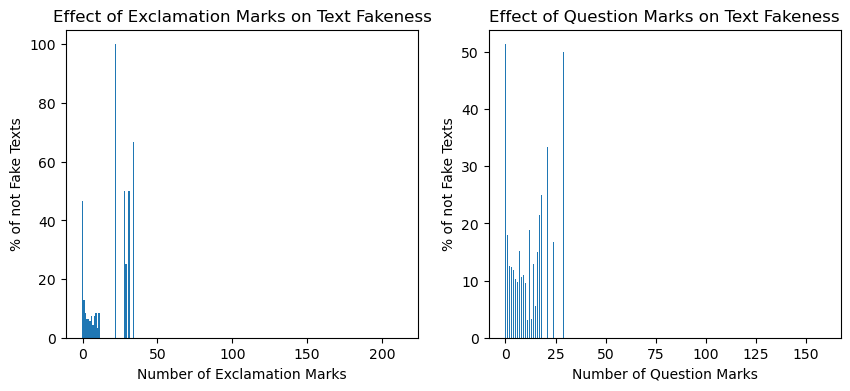
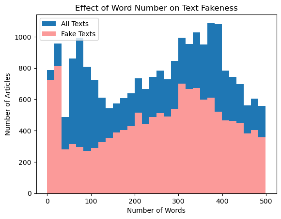

# Fake News Detection

## 1. Data preparation

### Importing Libraries


```python
import re
import string

import pandas as pd
import numpy as np
from langdetect import detect
from sklearn.model_selection import train_test_split

import matplotlib.pyplot as plt

from nltk.stem import WordNetLemmatizer
from nltk.corpus import stopwords
import nltk

# nltk.download('wordnet')
# nltk.download('stopwords')
# nltk.download('punkt')
# nltk.download('omw-1.4')

from sklearn.feature_extraction.text import TfidfVectorizer
from sklearn.preprocessing import MinMaxScaler
from scipy.sparse import hstack

import scipy
from sklearn.linear_model import LogisticRegression
from sklearn.tree import DecisionTreeClassifier
from sklearn.ensemble import GradientBoostingClassifier
from keras.models import Sequential
from keras.layers import Dense, Dropout
from keras.preprocessing.sequence import TimeseriesGenerator
import keras
import tensorflow as tf
from keras.utils import to_categorical
```

### Importing Dataset


```python
df_whole = pd.read_csv("PreProcessedData.csv")
```

### Familiarization with the data


```python
df_whole.head()
```


<div>
<style scoped>
    .dataframe tbody tr th:only-of-type {
        vertical-align: middle;
    }

    .dataframe tbody tr th {
        vertical-align: top;
    }

    .dataframe thead th {
        text-align: right;
    }
</style>
<table border="1" class="dataframe">
  <thead>
    <tr style="text-align: right;">
      <th></th>
      <th>index</th>
      <th>title</th>
      <th>text</th>
      <th>Ground Label</th>
    </tr>
  </thead>
  <tbody>
    <tr>
      <th>0</th>
      <td>0</td>
      <td>Ann Coulter Make Believes She Has ‘Gay Friend...</td>
      <td>It s hard to believe, but Donald Trump does ha...</td>
      <td>fake</td>
    </tr>
    <tr>
      <th>1</th>
      <td>1</td>
      <td>Rating: Moody‘s verbessert Ausblick für Russla...</td>
      <td>bankensektor Der russische Staat werde die Ban...</td>
      <td>fake</td>
    </tr>
    <tr>
      <th>2</th>
      <td>2</td>
      <td>CAN WE ADD DIRTY MONEY ‘LAUNDERING’ To The Oba...</td>
      <td>A member of the House Intelligence Committee i...</td>
      <td>fake</td>
    </tr>
    <tr>
      <th>3</th>
      <td>3</td>
      <td>Republicans on Obamacare repeal: 'We're going ...</td>
      <td>WASHINGTON (Reuters) - House of Representative...</td>
      <td>true</td>
    </tr>
    <tr>
      <th>4</th>
      <td>4</td>
      <td>Trump, on possible DACA deal, says border wall...</td>
      <td>WASHINGTON (Reuters) - U.S. President Donald T...</td>
      <td>true</td>
    </tr>
  </tbody>
</table>
</div>


```python
df_whole.info()
```

    <class 'pandas.core.frame.DataFrame'>
    RangeIndex: 69045 entries, 0 to 69044
    Data columns (total 4 columns):
     #   Column        Non-Null Count  Dtype 
    ---  ------        --------------  ----- 
     0   index         69045 non-null  int64 
     1   title         68365 non-null  object
     2   text          68978 non-null  object
     3   Ground Label  69045 non-null  object
    dtypes: int64(1), object(3)
    memory usage: 2.1+ MB
    

### We check the percentage of true articles


```python
len(df_whole[df_whole['Ground Label']=="true"])/len(df_whole)
```


    0.3893982185531175


### We divide the dataset into a training set and a validation set


```python
df, valid = train_test_split(
    df_whole, stratify=df_whole["Ground Label"], test_size=0.3, random_state=42
)
```


```python
valid.head()
```


<div>
<style scoped>
    .dataframe tbody tr th:only-of-type {
        vertical-align: middle;
    }

    .dataframe tbody tr th {
        vertical-align: top;
    }

    .dataframe thead th {
        text-align: right;
    }
</style>
<table border="1" class="dataframe">
  <thead>
    <tr style="text-align: right;">
      <th></th>
      <th>index</th>
      <th>title</th>
      <th>text</th>
      <th>Ground Label</th>
    </tr>
  </thead>
  <tbody>
    <tr>
      <th>7765</th>
      <td>7765</td>
      <td>Donald Trump Just Took Credit For Christmas A...</td>
      <td>Americans have been spending well over $2 tril...</td>
      <td>fake</td>
    </tr>
    <tr>
      <th>28281</th>
      <td>28281</td>
      <td>Australia Successfully Reformed Gun Laws, Why ...</td>
      <td>An Embattled Pharmaceutical Company That Sells...</td>
      <td>fake</td>
    </tr>
    <tr>
      <th>41152</th>
      <td>41152</td>
      <td>WWN’s Horoscopes</td>
      <td>aries 21 March – 20 April \r\nLook at that stu...</td>
      <td>fake</td>
    </tr>
    <tr>
      <th>22071</th>
      <td>22071</td>
      <td>Something big is underway on all fronts: “With...</td>
      <td>VIDEOS Something big is underway on all fronts...</td>
      <td>fake</td>
    </tr>
    <tr>
      <th>68977</th>
      <td>68977</td>
      <td>U.S. Intelligence Says Details Of Russian Dos...</td>
      <td>When the bombshell dossier exposing Donald Tru...</td>
      <td>fake</td>
    </tr>
  </tbody>
</table>
</div>


```python
valid.to_csv('walidacja.csv', index=False)
```


```python
df, test = train_test_split(
    df, stratify=df["Ground Label"], test_size=0.3, random_state=42
)
```


```python
test.head()
```


<div>
<style scoped>
    .dataframe tbody tr th:only-of-type {
        vertical-align: middle;
    }

    .dataframe tbody tr th {
        vertical-align: top;
    }

    .dataframe thead th {
        text-align: right;
    }
</style>
<table border="1" class="dataframe">
  <thead>
    <tr style="text-align: right;">
      <th></th>
      <th>index</th>
      <th>title</th>
      <th>text</th>
      <th>Ground Label</th>
    </tr>
  </thead>
  <tbody>
    <tr>
      <th>40542</th>
      <td>40542</td>
      <td>Adele: No permission given to political campai...</td>
      <td>(Reuters) - British singer Adele made clear on...</td>
      <td>true</td>
    </tr>
    <tr>
      <th>38393</th>
      <td>38393</td>
      <td>BORDER COLLAPSE AMID ELECTION</td>
      <td>by DML DAILY / November 4, 2016 / IMMIGRATION ...</td>
      <td>fake</td>
    </tr>
    <tr>
      <th>34334</th>
      <td>34334</td>
      <td>Tim Allen: Hollywood Bullies Trump Supporters</td>
      <td>On The Kelly File Monday, actor Tim Allen disc...</td>
      <td>fake</td>
    </tr>
    <tr>
      <th>21406</th>
      <td>21406</td>
      <td>North Korea sentences South Korean reporters t...</td>
      <td>SEOUL (Reuters) - A North Korean court sentenc...</td>
      <td>true</td>
    </tr>
    <tr>
      <th>60696</th>
      <td>60696</td>
      <td>ESPN Just Fired Curt Schilling For This Despi...</td>
      <td>ESPN just made an amazing stand against bigotr...</td>
      <td>fake</td>
    </tr>
  </tbody>
</table>
</div>


```python
test.to_csv('test.csv', index=False)
```

# 2. Data preprocessing

### We transform the 'Ground Label' column, containing 'fake' or 'true' strings to a 'class' column with binary values, 0 for 'fake' news and 1 for 'true' news


```python
#fake, true -> 0, 1
df['class']=np.where(df['Ground Label']=='fake', 0, 1)
df = df.drop('Ground Label', axis=1)
df = df.drop('index', axis=1)

```

### We fill in the empty values in the 'text' and 'title' columns


```python
df["text"] = df["text"].fillna("")
df["title"] = df["title"].fillna("")
```

### After checking that only 6% of articles without content and 0% of articles without a title are true, we can delete them


```python
print("True: ", df[df["text"]==""]["class"].sum(), "   All: ", len(df[df["text"]==""]["class"]))
print("True: ", df[df["title"]==""]["class"].sum(), "   All: ", len(df[df["title"]==""]["class"]))
df = df.drop(df[df["text"]==""].index)
df = df.drop(df[df["title"]==""].index)
```

    True:  2    All:  32
    True:  0    All:  326
    

### Let's check how the number of links in the text correlates with the truthfulness of articles


```python
def contains_link(text):
    regex = r'https?://\S+|www\.\S+'
    url = re.findall(regex, text)
    return len(url)
```


```python
df["links"] = df["text"].apply(contains_link)
print(df[df["links"]>0]["class"].sum(), len(df[df["links"]>0]))
print(df[df["links"]>1]["class"].sum(), len(df[df["links"]>1]))
print(df[df["links"]>2]["class"].sum(), len(df[df["links"]>2]))
print(df[df["links"]>3]["class"].sum(), len(df[df["links"]>3]))
```

    41 3047
    3 856
    1 395
    0 191
    

### Let's check how the number of question marks and exclamation marks in the text correlates with the truthfulness of articles


```python
df["question_marks"] = df["text"].apply(lambda x: x.count("?"))
df["exclamation_marks"] = df["text"].apply(lambda x: x.count("!"))
print(df[df["question_marks"]>0]["class"].sum(), len(df[df["question_marks"]>0]))
print(df[df["exclamation_marks"]>0]["class"].sum(), len(df[df["exclamation_marks"]>0]))

groupedq = df.groupby("question_marks")["class"].mean() * 100
groupede = df.groupby("exclamation_marks")["class"].mean() * 100

fig, ax = plt.subplots(nrows=1, ncols=2, figsize=(10, 4))

ax[0].bar(groupede.index, groupede.values)
ax[0].set_xlabel("Number of Exclamation Marks")
ax[0].set_ylabel("% of not Fake Texts")
ax[0].set_title("Effect of Exclamation Marks on Text Fakeness")

ax[1].bar(groupedq.index, groupedq.values)
ax[1].set_xlabel("Number of Question Marks")
ax[1].set_ylabel("% of not Fake Texts")
ax[1].set_title("Effect of Question Marks on Text Fakeness")

plt.show()
```

    1593 10909
    674 6756
    


    

    


### We can see that the higher number of links, question marks, or exclamation marks, the higher chance that the text is fake. To consider that information in our model we add extra columns with their number.

### We create clean function that cleans our text


```python
def clean(text):
    #usuwa wszystko w kwadratowych nawiasach
    text = re.sub('\[.*?\]', '', text)
    #usuwa wszystkie znaki niebędące literami ani cyframi
    text = re.sub("\\W"," ",text)
    #usuwa linki
    text = re.sub('https?://\S+|www\.\S+', '', text)
    #usuwa tagi
    text = re.sub('<.*?>+', '', text)
    #usuwa znaki interpunkcyjne
    text = re.sub('[%s]' % re.escape(string.punctuation), '', text)
    #usuwa entery
    text = re.sub('\n', '', text)
    #usuwa ciągi znaków zawierające cyfry
    text = re.sub('\w*\d\w*', '', text)
    #usuwa słowa jednoliterowe
    text = re.sub(r'\b\w\b', '', text)
    #usuwa puste spacje
    text = re.sub(r'\s+', ' ', text)
    return text
```

### We apply the clean function to columns "text" and "title"


```python
#Aplikujemy funkcję czyszczącą tekst
df["text"] = df["text"].apply(clean)
df["title"] = df["title"].apply(clean)
```

### Let's check how the frequency of capitalization of letters in the title affects the truthfulness of the article


```python
def count_capital_letters(text):
    count = 0
    for c in re.sub(r'\s+', '', text):
        if c.isupper():
            count += 1
    return count/max(len(text),1)
```


```python
df["capital_letters"] = df["text"].apply(count_capital_letters)
print(df[df["capital_letters"]>0.1]["class"].sum(), len(df[df["capital_letters"]>0.1]["class"]))
print(df[df["capital_letters"]>0.2]["class"].sum(), len(df[df["capital_letters"]>0.2]["class"]))
```

    70 1251
    3 147
    

### We transform columns to lowercase


```python
df["text"] = df["text"].apply(lambda x: x.lower())
df["title"] = df["title"].apply(lambda x: x.lower())
```

### Let's check how the number of words correlates with the truthfulness of articles


```python
df["num_words"] = df["text"].apply(lambda x: len(x.split()))
print(df[df["num_words"]<50]["class"].sum(), len(df[df["num_words"]<50]))

groupednum = df[df["num_words"]<500].groupby("num_words")["class"].mean() * 100

fig, ax = plt.subplots()

ax.hist(df[df["num_words"]<500]["num_words"], bins=30, label="All Texts")
ax.hist(df[(df["num_words"]<500) & (df["class"] == 0)]["num_words"], bins=30, color="#fb9a99", label="Fake Texts")
ax.set_xlabel("Number of Words")
ax.set_ylabel("Number of Articles")
ax.set_title("Effect of Word Number on Text Fakeness")
ax.legend()

plt.show()
```

    416 2232
    


    

    


### After the initial analysis, we noticed that all articles not written in English were not true. Therefore, when building a model based on our dataset, it will predict that articles written in languages other than English are not true. As a result, we decided to analyze only news articles written in English. To remove others later on, we created a function that detects the language.


```python
def detect_language(text):
    try:
        lang = detect(text)
    except:
        lang = 'unknown'
    return lang
```


```python
df["language"] = (df["text"]+df["title"]).apply(detect_language)
len(df[df["language"]!="en"])
```


    306


```python
df = df.drop(df[df["language"] != "en"].index)
```


```python
df.head()
```


<div>
<style scoped>
    .dataframe tbody tr th:only-of-type {
        vertical-align: middle;
    }

    .dataframe tbody tr th {
        vertical-align: top;
    }

    .dataframe thead th {
        text-align: right;
    }
</style>
<table border="1" class="dataframe">
  <thead>
    <tr style="text-align: right;">
      <th></th>
      <th>title</th>
      <th>text</th>
      <th>class</th>
      <th>links</th>
      <th>question_marks</th>
      <th>exclamation_marks</th>
      <th>capital_letters</th>
      <th>num_words</th>
      <th>language</th>
    </tr>
  </thead>
  <tbody>
    <tr>
      <th>38599</th>
      <td>hillary puts trump to shame with powerful res...</td>
      <td>after white nationalist rally in charlottesvil...</td>
      <td>0</td>
      <td>0</td>
      <td>0</td>
      <td>1</td>
      <td>0.031216</td>
      <td>310</td>
      <td>en</td>
    </tr>
    <tr>
      <th>29999</th>
      <td>exclusive clinton op ed ll look for common ground</td>
      <td>why you should vote for me in january america ...</td>
      <td>1</td>
      <td>0</td>
      <td>1</td>
      <td>0</td>
      <td>0.021406</td>
      <td>683</td>
      <td>en</td>
    </tr>
    <tr>
      <th>66335</th>
      <td>spy scandals globalism and the betrayal of ame...</td>
      <td>articles of the bound spy scandals globalism ...</td>
      <td>0</td>
      <td>0</td>
      <td>1</td>
      <td>0</td>
      <td>0.041473</td>
      <td>900</td>
      <td>en</td>
    </tr>
    <tr>
      <th>15786</th>
      <td>trump slams canada by using example border st...</td>
      <td>it can easily be said that donald trump doesn ...</td>
      <td>0</td>
      <td>0</td>
      <td>2</td>
      <td>3</td>
      <td>0.032641</td>
      <td>293</td>
      <td>en</td>
    </tr>
    <tr>
      <th>46420</th>
      <td>breaking america was punked no direct ties bet...</td>
      <td>could this be the biggest fake news story of a...</td>
      <td>0</td>
      <td>1</td>
      <td>1</td>
      <td>0</td>
      <td>0.053229</td>
      <td>223</td>
      <td>en</td>
    </tr>
  </tbody>
</table>
</div>


```python
unknown_mask = df["language"] == "unknown"
df.loc[unknown_mask, "language"] = df.loc[unknown_mask, "title"].apply(detect_language)

df=df[df.language=="en"].loc[:, df.columns != "language"]
```


```python
df.head()
```


<div>
<style scoped>
    .dataframe tbody tr th:only-of-type {
        vertical-align: middle;
    }

    .dataframe tbody tr th {
        vertical-align: top;
    }

    .dataframe thead th {
        text-align: right;
    }
</style>
<table border="1" class="dataframe">
  <thead>
    <tr style="text-align: right;">
      <th></th>
      <th>title</th>
      <th>text</th>
      <th>class</th>
      <th>links</th>
      <th>question_marks</th>
      <th>exclamation_marks</th>
      <th>capital_letters</th>
      <th>num_words</th>
    </tr>
  </thead>
  <tbody>
    <tr>
      <th>38599</th>
      <td>hillary puts trump to shame with powerful res...</td>
      <td>after white nationalist rally in charlottesvil...</td>
      <td>0</td>
      <td>0</td>
      <td>0</td>
      <td>1</td>
      <td>0.031216</td>
      <td>310</td>
    </tr>
    <tr>
      <th>29999</th>
      <td>exclusive clinton op ed ll look for common ground</td>
      <td>why you should vote for me in january america ...</td>
      <td>1</td>
      <td>0</td>
      <td>1</td>
      <td>0</td>
      <td>0.021406</td>
      <td>683</td>
    </tr>
    <tr>
      <th>66335</th>
      <td>spy scandals globalism and the betrayal of ame...</td>
      <td>articles of the bound spy scandals globalism ...</td>
      <td>0</td>
      <td>0</td>
      <td>1</td>
      <td>0</td>
      <td>0.041473</td>
      <td>900</td>
    </tr>
    <tr>
      <th>15786</th>
      <td>trump slams canada by using example border st...</td>
      <td>it can easily be said that donald trump doesn ...</td>
      <td>0</td>
      <td>0</td>
      <td>2</td>
      <td>3</td>
      <td>0.032641</td>
      <td>293</td>
    </tr>
    <tr>
      <th>46420</th>
      <td>breaking america was punked no direct ties bet...</td>
      <td>could this be the biggest fake news story of a...</td>
      <td>0</td>
      <td>1</td>
      <td>1</td>
      <td>0</td>
      <td>0.053229</td>
      <td>223</td>
    </tr>
  </tbody>
</table>
</div>


### Next, to extract valuable information from the text and improve the quality of the model, we lemmatize the text and remove the so-called stop words

### Lemmatization involves reducing different forms of a word to its basic form, or lemma. This way, we won't analyze words like car, cars, and car's separately, but rather identify them with their lemma - car.


```python
lemmatizer = WordNetLemmatizer()

def lemmatize_text(text):
    return " ".join([lemmatizer.lemmatize(word) for word in text.split()])
```


```python
df[["text", "title"]] = df[["text", "title"]].apply(lambda x: x.apply(lemmatize_text))
```

### Stop words are words that are very common in the language, but do not carry much meaning and can introduce noise into text analysis. Examples include and, but, the.


```python
stop_words = set(stopwords.words('english'))

def remove_stop_words(text):
    words = nltk.word_tokenize(text.lower())
    words = [word for word in words if word not in stop_words]
    return ' '.join(words)
```


```python
df[["text", "title"]] = df[["text", "title"]].apply(lambda x: x.apply(remove_stop_words))
```

### We save the data to csv


```python
df.to_csv('processed_Data.csv', index=False)
```

# 3. Building model

### Loading data from the previous subpoint.


```python
df = pd.read_csv("processed_Data.csv")
test = pd.read_csv("test.csv")
df["text"] = df["text"].fillna("")
df["title"] = df["title"].fillna("")
```

### We convert the preprocessed text into numerical vectors using the TF-IDF method.


```python
vectorizerText = TfidfVectorizer()
vectorizerTitle = TfidfVectorizer()

vectorizedText = vectorizerText.fit_transform(df["text"])
vectorizedTitle = vectorizerTitle.fit_transform(df["title"])

```

### We scale added columns


```python
scaler = MinMaxScaler()
df_part = df[["num_words","exclamation_marks","question_marks","links", "capital_letters"]]
scaled_df = pd.DataFrame(scaler.fit_transform(df_part), columns=df_part.columns)
scaled_df.head()
```


<div>
<style scoped>
    .dataframe tbody tr th:only-of-type {
        vertical-align: middle;
    }

    .dataframe tbody tr th {
        vertical-align: top;
    }

    .dataframe thead th {
        text-align: right;
    }
</style>
<table border="1" class="dataframe">
  <thead>
    <tr style="text-align: right;">
      <th></th>
      <th>num_words</th>
      <th>exclamation_marks</th>
      <th>question_marks</th>
      <th>links</th>
      <th>capital_letters</th>
    </tr>
  </thead>
  <tbody>
    <tr>
      <th>0</th>
      <td>0.015574</td>
      <td>0.004695</td>
      <td>0.000000</td>
      <td>0.000000</td>
      <td>0.036766</td>
    </tr>
    <tr>
      <th>1</th>
      <td>0.034313</td>
      <td>0.000000</td>
      <td>0.006289</td>
      <td>0.000000</td>
      <td>0.025211</td>
    </tr>
    <tr>
      <th>2</th>
      <td>0.045215</td>
      <td>0.000000</td>
      <td>0.006289</td>
      <td>0.000000</td>
      <td>0.048846</td>
    </tr>
    <tr>
      <th>3</th>
      <td>0.014720</td>
      <td>0.014085</td>
      <td>0.012579</td>
      <td>0.000000</td>
      <td>0.038444</td>
    </tr>
    <tr>
      <th>4</th>
      <td>0.011203</td>
      <td>0.000000</td>
      <td>0.006289</td>
      <td>0.029412</td>
      <td>0.062692</td>
    </tr>
  </tbody>
</table>
</div>


### We prepare the training data. We will use content, title and features we extracted in the preprocessing to train one model and we will use only content and title to train the other model. We can then compare if our preprocessing had some impact on the results.


```python
Xv_train= hstack([vectorizedTitle, vectorizedText,scipy.sparse.csr_matrix(scaled_df[["links","question_marks","exclamation_marks","capital_letters","num_words"]].values)])
Xv_train2 = hstack([vectorizedTitle, vectorizedText])
y_train = df['class']
```

### We preprocess the test data


```python
test['class']=np.where(test['Ground Label']=='fake', 0, 1)
test["text"] = test["text"].fillna("")
test["title"] = test["title"].fillna("")
test["links"] = test["text"].apply(contains_link)
test["question_marks"] = test["text"].apply(lambda x: x.count("?"))
test["exclamation_marks"] = test["text"].apply(lambda x: x.count("!"))
test["text"] = test["text"].apply(clean)
test["title"] = test["title"].apply(clean)
test["capital_letters"] = test["text"].apply(count_capital_letters)
test["text"] = test["text"].apply(lambda x: x.lower())
test["title"] = test["title"].apply(lambda x: x.lower())
test["num_words"] = test["text"].apply(lambda x: len(x.split()))
test[["text", "title"]] = test[["text", "title"]].apply(lambda x: x.apply(lemmatize_text))
test[["text", "title"]] = test[["text", "title"]].apply(lambda x: x.apply(remove_stop_words))
test.head()
```


<div>
<style scoped>
    .dataframe tbody tr th:only-of-type {
        vertical-align: middle;
    }

    .dataframe tbody tr th {
        vertical-align: top;
    }

    .dataframe thead th {
        text-align: right;
    }
</style>
<table border="1" class="dataframe">
  <thead>
    <tr style="text-align: right;">
      <th></th>
      <th>index</th>
      <th>title</th>
      <th>text</th>
      <th>Ground Label</th>
      <th>class</th>
      <th>links</th>
      <th>question_marks</th>
      <th>exclamation_marks</th>
      <th>capital_letters</th>
      <th>num_words</th>
    </tr>
  </thead>
  <tbody>
    <tr>
      <th>0</th>
      <td>40542</td>
      <td>adele permission given political campaign use ...</td>
      <td>reuters british singer adele made clear monday...</td>
      <td>true</td>
      <td>1</td>
      <td>0</td>
      <td>0</td>
      <td>0</td>
      <td>0.040161</td>
      <td>215</td>
    </tr>
    <tr>
      <th>1</th>
      <td>38393</td>
      <td>border collapse amid election</td>
      <td>dml daily november immigration illegal alien f...</td>
      <td>fake</td>
      <td>0</td>
      <td>0</td>
      <td>0</td>
      <td>0</td>
      <td>0.039648</td>
      <td>278</td>
    </tr>
    <tr>
      <th>2</th>
      <td>34334</td>
      <td>tim allen hollywood bully trump supporter</td>
      <td>kelly file monday actor tim allen discussed hy...</td>
      <td>fake</td>
      <td>0</td>
      <td>0</td>
      <td>0</td>
      <td>0</td>
      <td>0.043478</td>
      <td>39</td>
    </tr>
    <tr>
      <th>3</th>
      <td>21406</td>
      <td>north korea sentence south korean reporter dea...</td>
      <td>seoul reuters north korean court sentenced two...</td>
      <td>true</td>
      <td>1</td>
      <td>0</td>
      <td>0</td>
      <td>0</td>
      <td>0.044112</td>
      <td>436</td>
    </tr>
    <tr>
      <th>4</th>
      <td>60696</td>
      <td>espn fired curt schilling despicable facebook ...</td>
      <td>espn made amazing stand bigotry airwave firing...</td>
      <td>fake</td>
      <td>0</td>
      <td>0</td>
      <td>4</td>
      <td>1</td>
      <td>0.038238</td>
      <td>539</td>
    </tr>
  </tbody>
</table>
</div>


### We vectorize the test data using the previously created TF-IDF model.


```python
vectorizedTextTest = vectorizerText.transform(test["text"])
vectorizedTitleTest = vectorizerTitle.transform(test["title"])
```

### We scale the created column in the test data.


```python
test_part = test[["num_words","exclamation_marks","question_marks","links", "capital_letters"]]
scaled_test = pd.DataFrame(scaler.fit_transform(test_part), columns=test_part.columns)
```

### We prepare the test data


```python
test['class']=np.where(test['Ground Label']=='fake', 0, 1)
Xv_test= hstack([vectorizedTitleTest, vectorizedTextTest,scipy.sparse.csr_matrix(scaled_test[["links","question_marks","exclamation_marks","capital_letters","num_words"]].values)])
Xv_test2 = hstack([vectorizedTitleTest, vectorizedTextTest])
y_test = test['class']
```

### We create and test a logistic regression model.


```python
LR = LogisticRegression()
LR.fit(Xv_train, y_train)
print(LR.score(Xv_test, y_test))
```

    0.9533793103448276
    

### We create and test a second logistic regression model.


```python
LR2 = LogisticRegression()
LR2.fit(Xv_train2, y_train)
print(LR2.score(Xv_test2, y_test))
```

    0.9533103448275863
    

### We create and test a decision tree model.


```python
DT = DecisionTreeClassifier(max_depth=13)
DT.fit(Xv_train, y_train)
print(DT.score(Xv_test, y_test))
```

    0.94
    

### We create and test a second decision tree model.


```python
DT2 = DecisionTreeClassifier(max_depth=17)
DT2.fit(Xv_train2, y_train)
print(DT2.score(Xv_test2, y_test))
```

    0.9460689655172414
    

### We create and test a gradient boosting model.


```python
GBC = GradientBoostingClassifier(random_state=0)
GBC.fit(Xv_train, y_train)

print(GBC.score(Xv_test, y_test))
```

    0.9488965517241379
    

### We create and test a second gradient boosting model.


```python
GBC2 = GradientBoostingClassifier(random_state=0)
GBC2.fit(Xv_train2, y_train)

print(GBC2.score(Xv_test2, y_test))
```

    0.9473793103448276
    

### We create and test a neural network model. We add data generator because all the training data requires too much memory space.


```python
Xv_test_keras = Xv_test.toarray()

def data_generator(X, y, i, batch_size):
    num_batches = X.shape[0] // batch_size
    batch_X = X[i*batch_size:(i+1)*batch_size].toarray()
    batch_y = y[i*batch_size:(i+1)*batch_size]
    return batch_X, batch_y


model = Sequential()
model.add(Dense(512, input_shape=(Xv_train.shape[1],), activation='relu'))
model.add(Dropout(0.5))
model.add(Dense(256, activation='relu'))
model.add(Dropout(0.5))
model.add(Dense(1, activation='sigmoid'))

# Compile the model
model.compile(loss='binary_crossentropy', optimizer='adam', metrics=['accuracy'])

# Train the model
num_of_batches = 10
for i in range(num_of_batches):
    (a,b)=data_generator(Xv_train, y_train, (i+5)%10, Xv_train.shape[0]//num_of_batches)
    model.fit(a,b, epochs=1)
for i in range(num_of_batches):
    (a,b)=data_generator(Xv_train, y_train, i, Xv_train.shape[0]//num_of_batches)
    model.fit(a,b, epochs=1)

# Evaluate the model on the testing set
score = model.evaluate(Xv_test_keras, y_test, batch_size=32)
print("Accuracy:", score[1])
```

    104/104 [==============================] - 41s 378ms/step - loss: 0.3553 - accuracy: 0.8384
    104/104 [==============================] - 40s 387ms/step - loss: 0.1883 - accuracy: 0.9321
    104/104 [==============================] - 45s 434ms/step - loss: 0.1456 - accuracy: 0.9478
    104/104 [==============================] - 43s 415ms/step - loss: 0.1420 - accuracy: 0.9499
    104/104 [==============================] - 45s 434ms/step - loss: 0.1339 - accuracy: 0.9484
    104/104 [==============================] - 45s 433ms/step - loss: 0.1115 - accuracy: 0.9581
    104/104 [==============================] - 47s 455ms/step - loss: 0.1074 - accuracy: 0.9581
    104/104 [==============================] - 47s 449ms/step - loss: 0.1080 - accuracy: 0.9593
    104/104 [==============================] - 50s 476ms/step - loss: 0.1071 - accuracy: 0.9614
    104/104 [==============================] - 46s 441ms/step - loss: 0.0901 - accuracy: 0.9662
    104/104 [==============================] - 47s 455ms/step - loss: 0.0166 - accuracy: 0.9973
    104/104 [==============================] - 45s 429ms/step - loss: 0.0189 - accuracy: 0.9931
    104/104 [==============================] - 41s 390ms/step - loss: 0.0142 - accuracy: 0.9955
    104/104 [==============================] - 47s 450ms/step - loss: 0.0208 - accuracy: 0.9907
    104/104 [==============================] - 43s 409ms/step - loss: 0.0134 - accuracy: 0.9964
    104/104 [==============================] - 48s 463ms/step - loss: 0.0587 - accuracy: 0.9780
    104/104 [==============================] - 45s 433ms/step - loss: 0.0534 - accuracy: 0.9795
    104/104 [==============================] - 45s 434ms/step - loss: 0.0271 - accuracy: 0.9900
    104/104 [==============================] - 43s 415ms/step - loss: 0.0431 - accuracy: 0.9834
    104/104 [==============================] - 41s 396ms/step - loss: 0.0324 - accuracy: 0.9897
    454/454 [==============================] - 25s 50ms/step - loss: 0.1304 - accuracy: 0.9588
    Accuracy: 0.9588276147842407
    

### We create and test a second neural network model.


```python
Xv_test_keras = Xv_test2.toarray()

def data_generator(X, y, i, batch_size):
    num_batches = X.shape[0] // batch_size
    batch_X = X[i*batch_size:(i+1)*batch_size].toarray()
    batch_y = y[i*batch_size:(i+1)*batch_size]
    return batch_X, batch_y


model = Sequential()
model.add(Dense(512, input_shape=(Xv_train2.shape[1],), activation='relu'))
model.add(Dropout(0.5))
model.add(Dense(256, activation='relu'))
model.add(Dropout(0.5))
model.add(Dense(1, activation='sigmoid'))

# Compile the model
model.compile(loss='binary_crossentropy', optimizer='adam', metrics=['accuracy'])

# Train the model
num_of_batches = 10
for i in range(num_of_batches):
    (a,b)=data_generator(Xv_train2, y_train, (i+5)%10, Xv_train2.shape[0]//num_of_batches)
    model.fit(a,b, epochs=1)
for i in range(num_of_batches):
    (a,b)=data_generator(Xv_train2, y_train, i, Xv_train2.shape[0]//num_of_batches)
    model.fit(a,b, epochs=1)

# Evaluate the model on the testing set
score = model.evaluate(Xv_test_keras, y_test, batch_size=32)
print("Accuracy:", score[1])
```

    104/104 [==============================] - 41s 385ms/step - loss: 0.3475 - accuracy: 0.8459
    104/104 [==============================] - 43s 416ms/step - loss: 0.1973 - accuracy: 0.9291
    104/104 [==============================] - 48s 459ms/step - loss: 0.1454 - accuracy: 0.9460
    104/104 [==============================] - 50s 467ms/step - loss: 0.1466 - accuracy: 0.9502
    104/104 [==============================] - 45s 429ms/step - loss: 0.1340 - accuracy: 0.9502
    104/104 [==============================] - 45s 431ms/step - loss: 0.1183 - accuracy: 0.9569
    104/104 [==============================] - 46s 446ms/step - loss: 0.1046 - accuracy: 0.9605
    104/104 [==============================] - 46s 440ms/step - loss: 0.1127 - accuracy: 0.9545
    104/104 [==============================] - 44s 423ms/step - loss: 0.1120 - accuracy: 0.9578
    104/104 [==============================] - 44s 424ms/step - loss: 0.0893 - accuracy: 0.9668
    104/104 [==============================] - 47s 449ms/step - loss: 0.0174 - accuracy: 0.9952
    104/104 [==============================] - 47s 449ms/step - loss: 0.0191 - accuracy: 0.9931
    104/104 [==============================] - 45s 429ms/step - loss: 0.0151 - accuracy: 0.9955
    104/104 [==============================] - 43s 412ms/step - loss: 0.0180 - accuracy: 0.9928
    104/104 [==============================] - 44s 422ms/step - loss: 0.0126 - accuracy: 0.9949
    104/104 [==============================] - 48s 462ms/step - loss: 0.0559 - accuracy: 0.9801
    104/104 [==============================] - 49s 477ms/step - loss: 0.0491 - accuracy: 0.9792
    104/104 [==============================] - 48s 458ms/step - loss: 0.0284 - accuracy: 0.9900
    104/104 [==============================] - 50s 479ms/step - loss: 0.0359 - accuracy: 0.9861
    104/104 [==============================] - 55s 524ms/step - loss: 0.0322 - accuracy: 0.9894
    454/454 [==============================] - 25s 55ms/step - loss: 0.1298 - accuracy: 0.9597
    Accuracy: 0.9596551656723022
    

# 4. Summary

### Based on the conducted analyses and tests, we can conclude that generally the models created by us perform well. The test results showed that each model has a high accuracy exceeding 90%.

### As it turned out our additional preprocessing had almost no impact on the results.


```python

```
